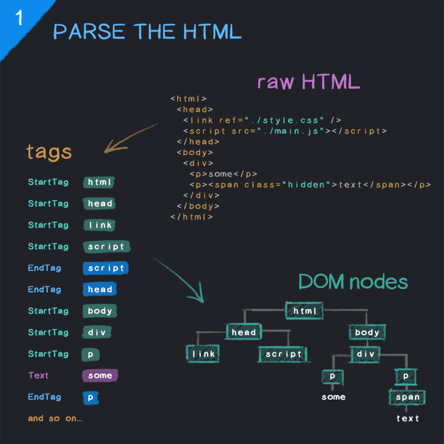
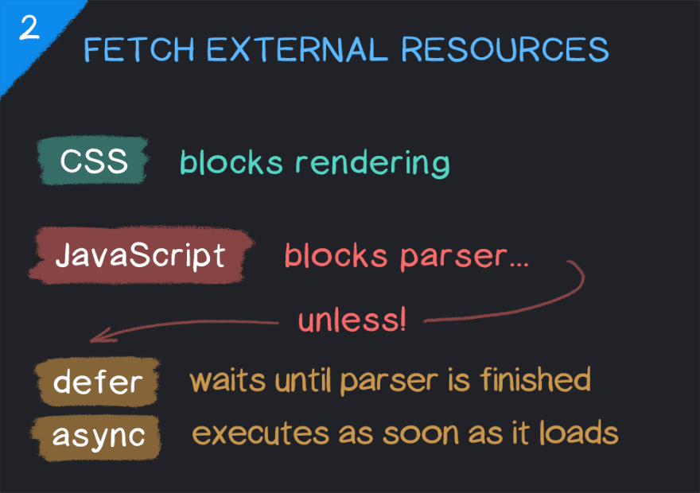
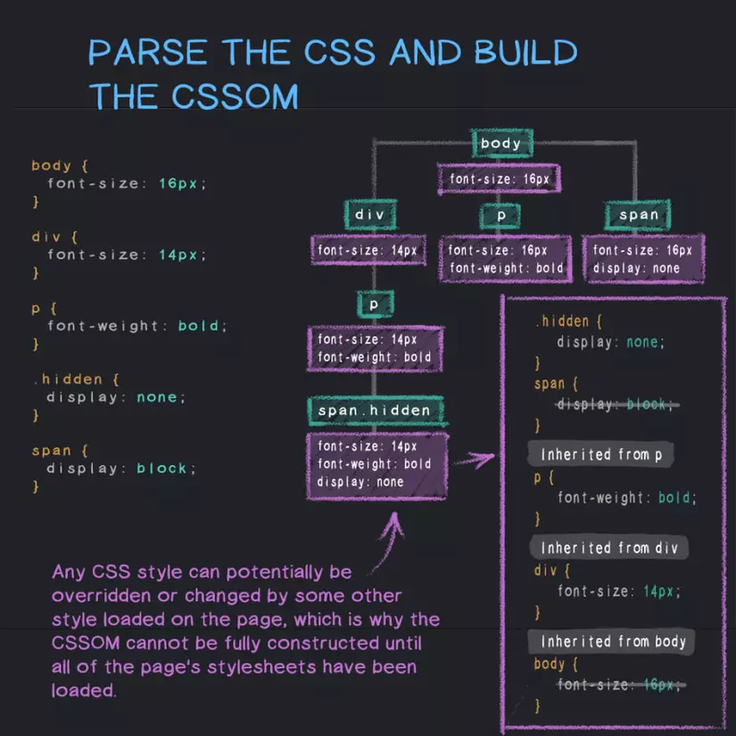
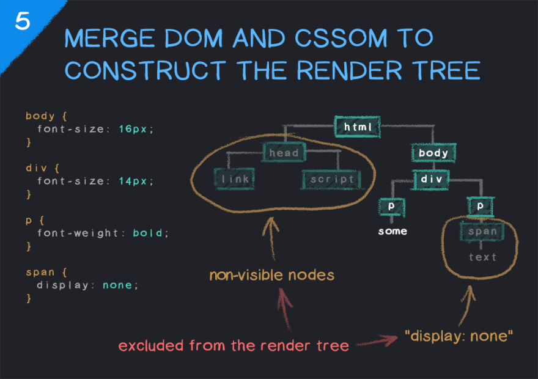
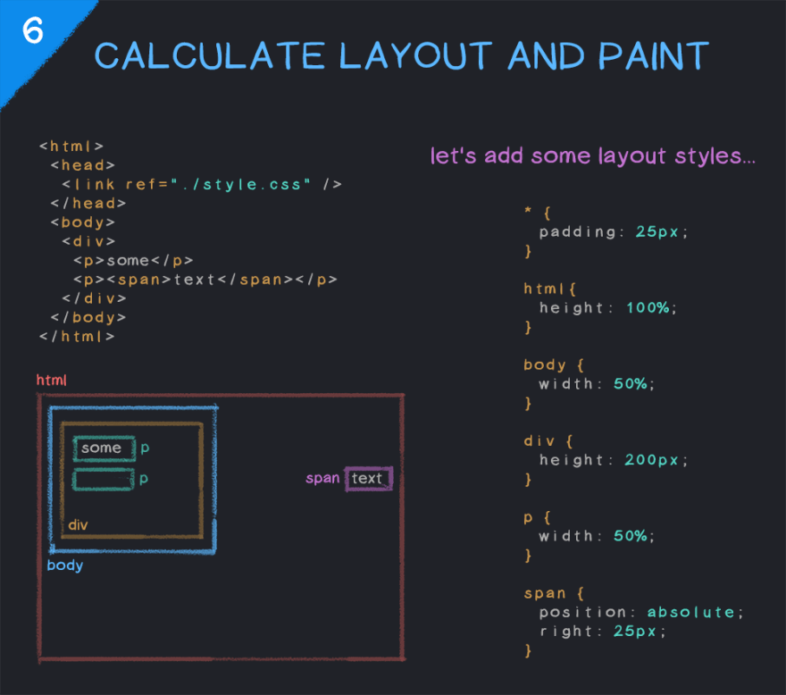

{/* truncate */}

### Tại sao nên đọc bài này?
* Hiểu rõ hơn về cách trình duyệt render website
* Có thể giúp bạn giải quyết một số vấn đề liên quan đến hiệu suất website
* Làm màu, loè thiên hạ, thể hiện ta là người hiểu rõ cơ chế ngọn ngành 😏


### Phân tích cú pháp HTML
 Tạm bỏ qua quá trình từ khi chúng ta nhập 1 địa chỉ url vào thanh tìm kiếm, chúng ta bắt đầu phân tích kể từ khi browser nhận được nội dung HTML.

 Kể từ khi nhận được thông tin HTML, trình duyệt sẽ bắt đầu phân tích cú pháp HTML thành DOM.

 > The Document Object Model (DOM) is the data representation of the objects that comprise the structure and content of a document on the web.



Hiểu đơn giản quá trình này sẽ phân tách HTML document thành những đối tượng con là các thẻ, nội dung của chúng. Từ những đối tượng này, trình duyệt sẽ xây dựng cấu trúc cây DOM.

### Tải external resources

External resources bao gồm các file css, js, image, font, ...
Quá trình đọc và phân tích HTML sẽ được diễn ra tuần tự từ đầu document đến cuối document. Khi gặp các thẻ link, script, img, ... trình duyệt sẽ bắt đầu tải các file này.

Đối với external resource chúng ta cần quan tâm resource này ảnh hưởng thế nào tới quá trình hiển thị trang web.
Có 2 khái niệm chúng ta cần nắm bắt được là "Block parsing" và "Block rendering"

* Block parsing: trong quá trình này, trình duyệt sẽ không thể tiếp tục phân tích cú pháp HTML cho đến khi tải xong file này.
* Block rendering: trình duyệt sẽ không thể render trang web cho đến khi tải xong file này.

CSS là block rendering resource, còn JS là block parsing resource.

Cùng suy nghĩ chút tại sao lại vậy, vì sao trình duyệt không thực hiện song song mà lại có hiện tượng blocking tại đây.

#### Parsing block scripts
Đối với Javascript. Khi gặp thẻ script trình duyệt sẽ dừng việc phân tích HTML, tải file js về và thực thi, kết thúc quá trình mới tiếp tục phân tích HTML thành DOM. Trình duyệt cung cấp DOM API cho Javascript Runtime, điều này cho phép JS truy cập và quản lý các phần tử của DOM, nếu trình duyệt chưa xây dựng xong DOM thì Javascript sẽ không thể thao tác trên DOM. Nếu quá trình parsing HTML và thực thi JS diễn ra song song có thể dẫn tới hiện tượng Race Conditions

> A "race condition" exists when multithreaded (or otherwise parallel) code that would access a shared resource could do so in such a way as to cause unexpected results.

Race conditions là vấn đề nhức nhối, phổ biến trong lập trình cũng như đời sống hàng ngày. Thử tưởng tượng bạn rủ crush đi chơi, nhưng crush lại đi chơi với thằng khác đúng thời điểm đó => Nghĩ thôi đã thấy "Cayyyyy" 😢

Trong thực tế việc parse blocking khi js được tải là không cần thiết nếu ta là chủ được tài nguyên. Do đó HTML5 cung cấp cho ta 2 thuộc tính defer và async để giải quyết vấn đề này.

``` javascript
<script type="text/javascript" src="script.js" defer>
<script type="text/javascript" src="script.js" async>
```

* defer: cho phép tải file js mà không block parsing HTML, thực thi js sau khi DOM được xây dựng xong. Nhiều file được defer sẽ thực thi theo thứ tự xuất hiện trong HTML.
* async: cho phép tải file js mà không block parsing HTML, thực thi js ngay sau khi tải xong. Nhiều file được async sẽ thực thi đồng thời ngay khi file được tải.


#### Rendering block CSS
Đối với HTML chúng ta có khái niệm DOM, đối với CSS chúng ta cũng có khái niệm CSSOM

> The CSS Object Model (CSSOM) is a map of all CSS selectors and relevant properties for each selector in the form of a tree, with a root node, sibling, descendant, child, and other relationship. The CSSOM is very similar to the Document Object Model (DOM). Both of them are part of the critical rendering path which is a series of steps that must happen to properly render a website. <br/>
> The CSSOM, together with the DOM, to build the render tree, which is in turn used by the browser to layout and paint the web page.

Có 1 điểm khác biệt giữa DOM và CSSOM là DOM được xây dựng tuần tự từ trên xuống dưới, còn CSSOM khi không. 
Khi gặp external resource CSS file trình duyệt sẽ thực hiện tải CSS file dưới background mà không block quá trình parsing HTML. Nhưng trình duyệt sẽ không thực hiện ngay việc parsing CSS thành CSSOM một cách tuần tự, CSSOM chỉ xảy ra khi toàn bộ CSS đã được xử lý và sẵn sàng. Nguyên nhân có thể hiểu CSS là ***Cascading*** có nghĩa là CSS có thể bị ghi đè, chắc hẳn bạn không muốn thấy style của trang web nhảy và được cập nhật liên tục chứ. Do đó CSSOM chỉ được xây dựng khi toàn bộ CSS đã được tải về và sẵn sàng. CSSOM tree được hoàn thiện kết hợp với DOM tree render trang web của bạn => CSS là render blocking.

Kết luận: CSS là render blocking => Tải CSS sớm nhất có thể. Liệu rằng bạn có để ý thẻ link css của bạn thường đặt ở đầu không? Có nguyên nhân đó 😏



### Kết hợp DOM và CSSOM cấu tạo nên render tree

### Events
#### DOMContentLoaded Events
Sự kiện này báo hiệu ta có thể truy cập đến thành phần của DOM tree 1 cách an toàn. Một số script cần thao tác với DOM sẽ cần lắng nghe sự kiện này để có thể truy cập 1 cách an toàn. DOMContentLoaded sẽ nhanh chóng được trigger
``` javascript
document.addEventListener("DOMContentLoaded", function(){
    // DOM đã hoàn thành bạn có thể truy cập và thao tác trên DOM
});
```
#### Load Events

``` javascript
window.addEventListener( "load", function(e) {
  console.log( "Trang web đã được tải về đầy đủ. " );
});
```

Sự kiện này xuất hiện khi toàn bộ stylesheet và files đã được tải xuống và trang web đã được render hoàn toàn.


### Tính toán bố cục và kết xuất giao diện
Khi ta đã có DOM tree và CSSOM tree chúng sẽ kết hợp để tạo thành Render tree. Render tree chứa các phần tử cần được hiển thị trên trang web, nó sẽ bỏ qua các phần tử không cần thiết như display: none, script, ... <br/>
Render tree cho chúng ta biết cách hiển thị trên trang web.


Browser sẽ tạo ra bố cục của từng Render tree node bao gồm tính toán size, position, margin, padding, ... => Gọi là quá trình layout

Browser xác đinh thứ tự vẽ các node của render tree => Gọi là quá trình paint

Khi có sự thay đổi về mặt bố cục trang web, các node thay đổi về kích thước, vị trí => Quá trình reflow

Khi các node có sự thay đổi về thuộc tính màu sắc , ... nhưng không thay đổi về mặt bố cục => Quá trình repaint

Chúng ta cần quan tâm đến các quá trình này để tối ưu performance. Sẽ được phân tích ở những bài viết sau.



### Kết luận
Quá trình render 1 trang web là một quá trình phức tạp mà mỗi lập trình viên web nên biết và nắm được. Hiểu được cơ chế của browser khi render 1 trang web giúp lập trình viên có thể nhận biết được những vấn đề và giải quyết những vấn đề liên quan tới hiệu suất của trang web.<br />

Quan trọng hơn quá trình xây dựng từ những nền tảng luôn giúp chúng ta có thể thích nghi trong môi trường luôn có sự thay đổi. 

### Tài liệu tham khảo

https://dev.to/starkiedev/how-the-browser-renders-a-web-page-1ahc
https://www.explainthis.io/en/swe/fe-script-async-defer-difference